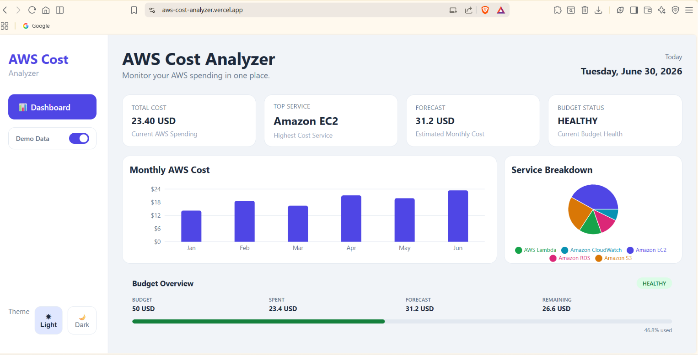
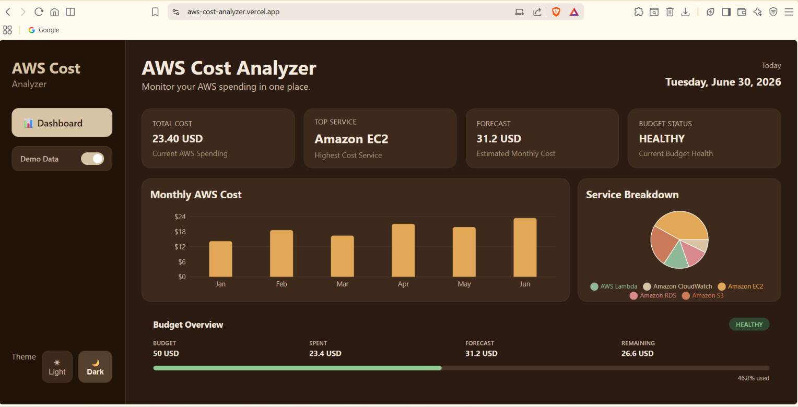

# AWS Cost Analyzer Dashboard

A dashboard that pulls AWS billing data through the Cost Explorer API and presents it in a simple, readable way—showing total spend, cost by service, monthly spending trends, and budget tracking in one place.

I built this as my first full-stack cloud project to combine what I was learning in AWS with React, Flask, and REST APIs. The goal was to understand how cloud billing data can be collected, processed, and visualized through a real application.

**Live Demo:** https://aws-cost-analyzer.vercel.app/

> **Note:** The deployed application runs in demo mode by default.

---

## Why Demo Mode?

The dashboard uses AWS Cost Explorer and AWS Budgets through `boto3`, which requires valid AWS credentials.

Since I didn't want to expose my personal AWS billing information publicly—and because Cost Explorer API requests are billable—the deployed version uses realistic sample data by default.

The backend still contains the complete AWS integration. If you run the project locally with your own AWS credentials, it will fetch real billing information from your AWS account.

---

## Screenshots

### Light Theme



### Dark Theme



---

## Tech Stack

### Frontend

- React
- Recharts
- CSS

### Backend

- Flask
- boto3
- Flask-CORS

### AWS Services

- AWS Cost Explorer API
- AWS Budgets API

### Deployment

- Vercel (Frontend)
- Render (Backend)

---

## Running Locally

Clone the repository:

```bash
git clone https://github.com/asnamobin-hue/aws-cost-analyzer.git
cd aws-cost-analyzer
```

### Backend

```bash
pip install -r requirements.txt
python app.py
```

### Frontend

```bash
cd frontend
npm install
npm start
```

By default, the application starts in demo mode.

If you'd like to use your own AWS billing data:

1. Configure your AWS credentials:

```bash
aws configure
```

2. Open `app.py` and change:

```python
DEMO_MODE = True
```

to

```python
DEMO_MODE = False
```

3. Restart the backend.

The dashboard will now fetch billing information from the AWS account associated with your configured credentials.

---

## Future Improvements

- Custom date range selection
- CSV export for reports
- Authentication for live AWS data
- Multi-account AWS support
- Better loading and error states

---

## Author

**Asna Mobin**

GitHub: https://github.com/asnamobin-hue

LinkedIn: https://www.linkedin.com/in/asna-mobin-57b5aa380

---

## License

This project is licensed under the MIT License.
